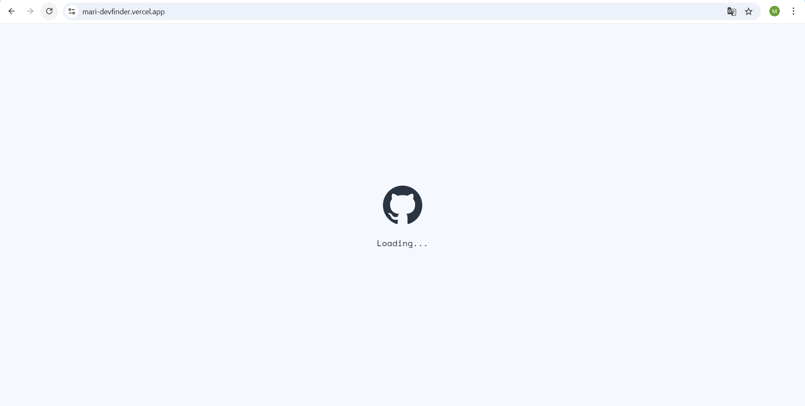
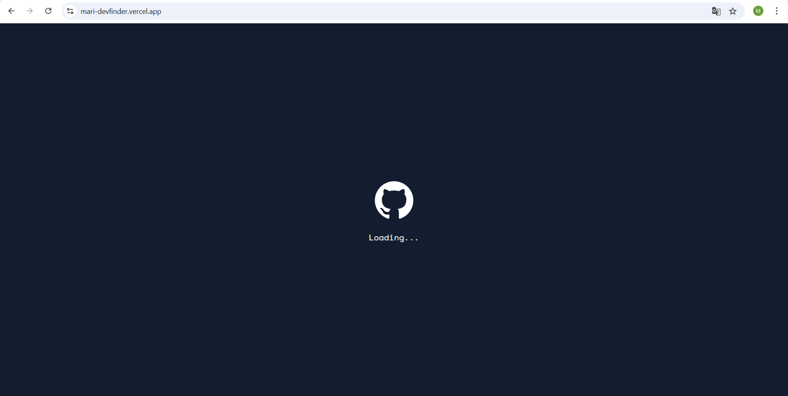
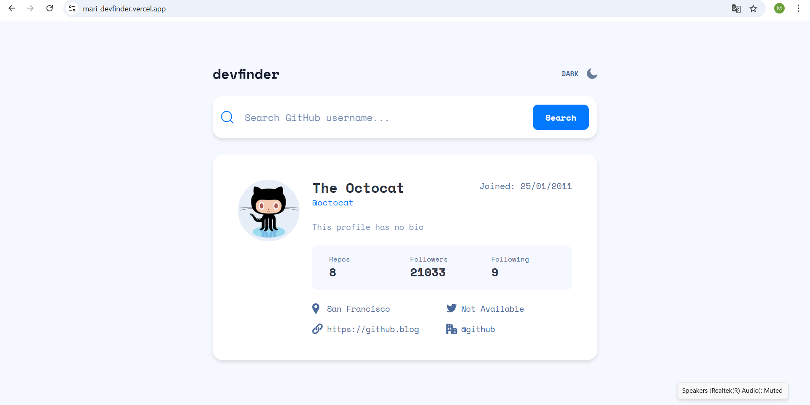
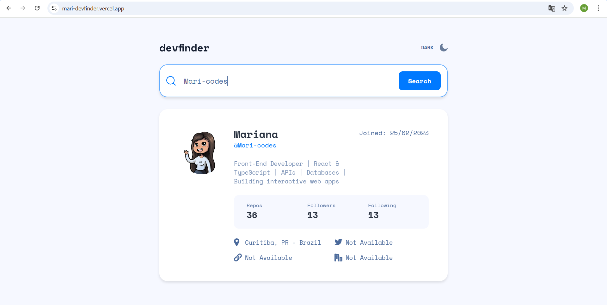
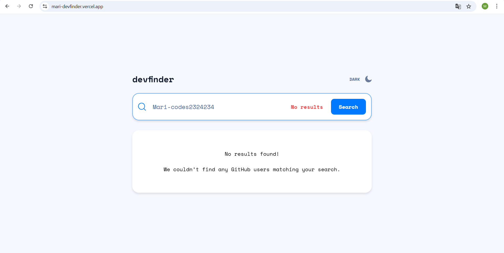
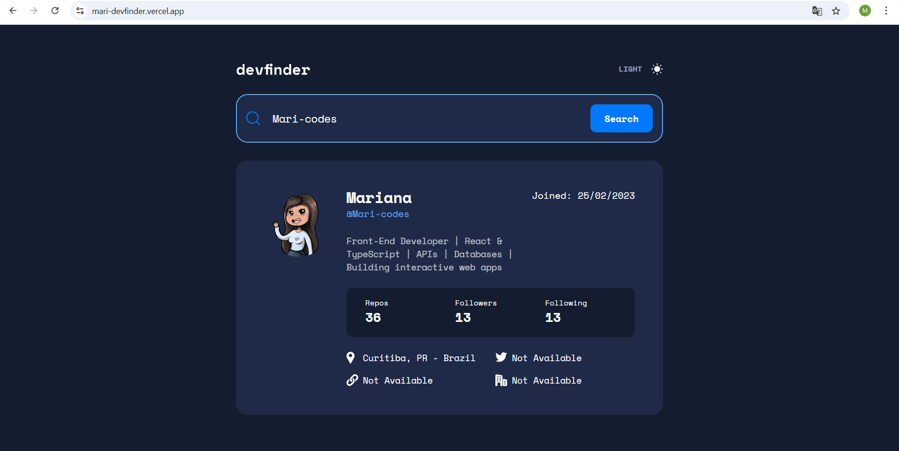

# devfinder

## Read this in other languages
- [Português (Brasil)](./docs/README.pt-BR.md)
  
devfinder is a responsive web application built with **React + Vite** and **JavaScript** that allows users to search for GitHub profiles and view detailed information about them. It leverages the GitHub API to provide a clean and intuitive interface for exploring developer profiles.

Check out the project running here: [Devfinder on Vercel](https://mari-devfinder.vercel.app/)

---

## Features

- **Search GitHub Users**: Find any GitHub user by username.
- **Profile Information**: Displays user photo, name, username, bio, creation date, followers, repositories, location, workplace, and personal website.
- **Themes**: Light and dark themes available, with preferences saved in local storage.
- **Responsive Design**: Fully optimized for desktop, tablet, and mobile devices.
- **Loading Screen**: Initial loading screen for a smooth user experience.

---

## Tech Stack

| Technology        | Purpose                                   |
|-------------------|-------------------------------------------|
| **React + Vite**         |  App setup and UI                      |
| **JavaScript** | Logic and state management |
| **Axios**         | HTTP client for API requests              |
| **Scss**          | Styling                                   |
| **CSS Modules**   | Scoped component styles                   |
| **BEM Methodology** | Organized and maintainable CSS structure |
| **SVGR**          | SVG handling                              |
| **ESLint & Prettier** | Code quality and formatting tools      |

---

## Getting Started

### Prerequisites
- Node.js (>= 14.x)
- npm or yarn

### Installation
1. Clone the repository:
   ```bash
   git clone https://github.com/your-username/devfinder.git
   ```
2. Navigate to the project folder:
   ```bash
   cd devfinder
   ```
3. Install dependencies:
   ```bash
   npm install
   ```
   or
   
   ```bash
   yarn install
   ```
## Running the Project

```sh
npm run dev
```
or
```bash
yarn dev
```

## Screenshots

### Loading (Light & Dark Mode)



### Home (Light Mode)


### User Profile


### User Not Found


### Profile (Dark Mode)

